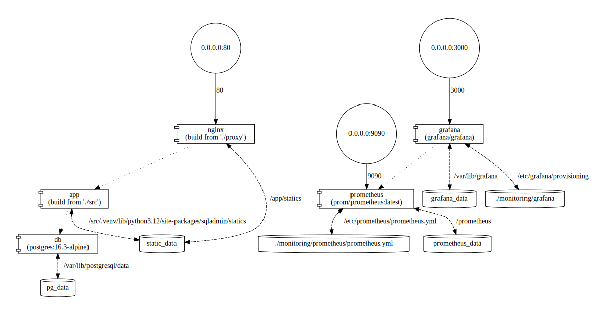
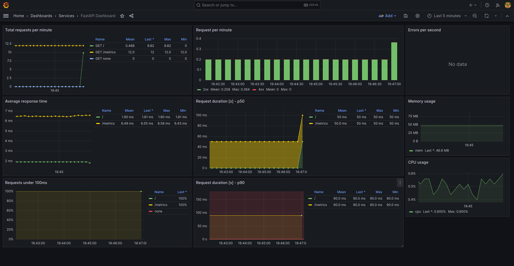

## About
This project represents a fork of [Kludex](https://github.com/Kludex)'s [repository](https://github.com/Kludex/fastapi-prometheus-grafana), which demonstrates how to integrate and use Prometheus and Grafana for monitoring a FastAPI application. 


## What's Added?
The original [repository](https://github.com/Kludex/fastapi-prometheus-grafana) provides a basic "hello world" FastAPI application with Prometheus and Grafana integration. This fork extends that functionality by implementing:
* integration with [UV](https://github.com/astral-sh/uv) to manage project requirements, linting by [Ruff](https://github.com/astral-sh/ruff), and static type checking with [MyPy](https://github.com/python/mypy);
* a full-fledged user management system with CRUD operations provided by [FastCRUD](https://github.com/benavlabs/fastcrud);
* integration with PostgreSQL using [SQLModel](https://github.com/fastapi/sqlmodel) as the ORM;
* basic admin interface based on [SQLAdmin](https://github.com/aminalaee/sqladmin) library;
* Nginx for hosting static data.


## System Requirements
* Python 3.12
* UV package manager
* Docker and Docker Compose plugin


## Configuration
The application can be configured using environment variables defined in the `.env` file. Key configurations include:
* settings for FastAPI application;
* settings for PostgreSQL;
* settings for Prometheus and Grafana.

Use [.env.example](.env.example) file as a template to create your own `.env` file.


## Deployment
Once the configuration file is set up, you can deploy the application using Docker Compose:
```
docker compose up -d
```

The will start all necessary services including the FastAPI app, PostgreSQL database, Prometheus, Grafana and Nginx. The diagram below illustrates the architecture of the deployed services:




## Usage
Once all services are up and running, you can access the following endpoints:

- **API Docs**: http://localhost:8080/docs
- **Admin UI**: http://localhost:8080/admin
- **Prometheus**: http://localhost:9090
- **Grafana**: http://localhost:3000 (use credentials, set in the .env file)

The configuration file for Grafana hasn't changed and remains the same as in the original [repository](https://github.com/Kludex/fastapi-prometheus-grafana):




## References

- Original [FastAPI-Prometheus-Grafana](https://github.com/Kludex/fastapi-prometheus-grafana) repository provided by [Kludex](https://github.com/Kludex)
- [Prometheus FastAPI Instrumentator](https://github.com/trallnag/prometheus-fastapi-instrumentator)
- [FastCRUD](https://github.com/igorbenav/fastcrud) for automatic CRUD operations
- [SQLModel](https://github.com/fastapi/sqlmodel) for the ORM
- [SQLAdmin](https://github.com/aminalaee/sqladmin) for the admin interface

## License
This project is licensed under the MIT License - see the [LICENSE](LICENSE) file for details.
