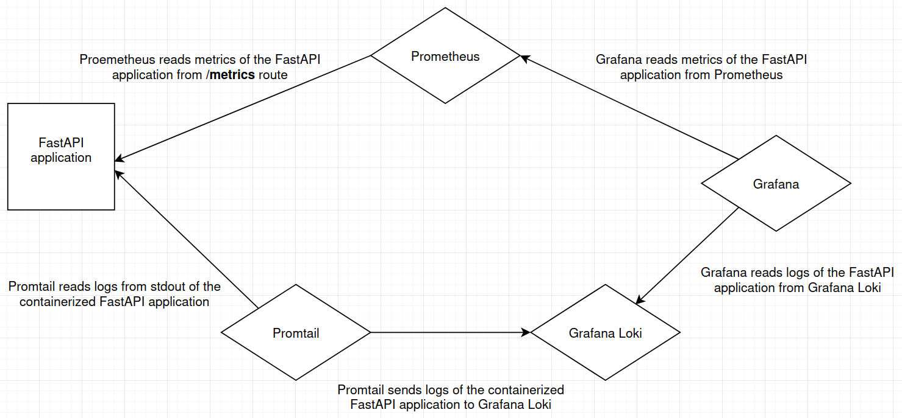
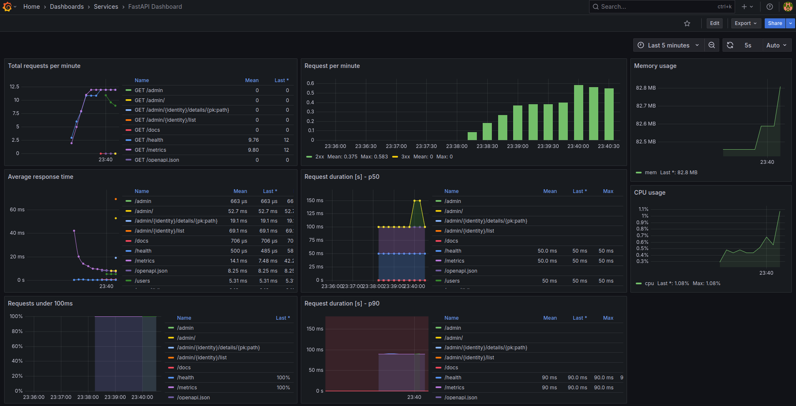
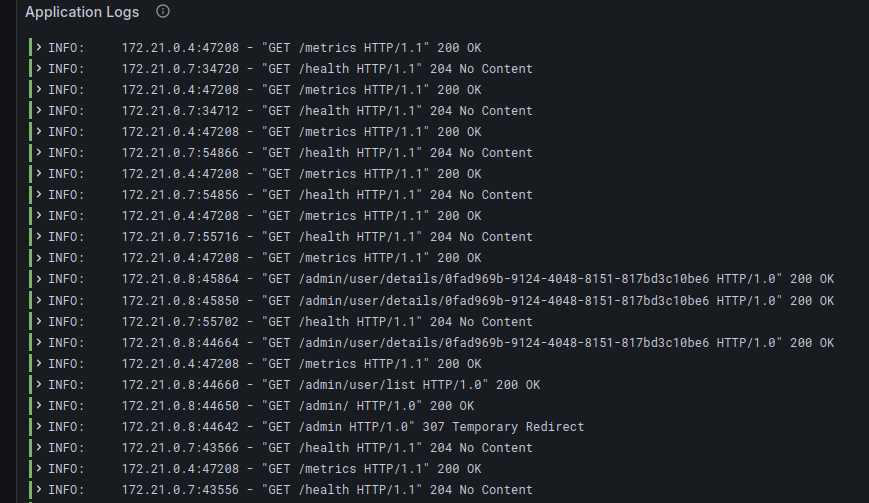

[](https://mypy-lang.org/)
[](https://github.com/charliermarsh/ruff)


## About
This project is a fork of [Kludex](https://github.com/Kludex)'s [repository](https://github.com/Kludex/fastapi-prometheus-grafana), which originally provides a way to integrate Prometheus + Grafana with a FastAPI application. This repository extends the original functionality by providing integration with [Promtail and Grafana Loki](https://github.com/grafana/loki) for observability of the FastAPI application:




## Other Features
* integration with [UV](https://github.com/astral-sh/uv) to manage project requirements;
* upgraded FastAPI application to provide CRUD operations on users achieved by [FastCRUD](https://github.com/benavlabs/fastcrud);
* integration with [SQLModel](https://github.com/fastapi/sqlmodel) to store user data in PostgreSQL database;
* basic admin interface based on [SQLAdmin](https://github.com/aminalaee/sqladmin) package;
* Nginx for hosting static data in the dockerized environment.


## System Requirements
* Python 3.12
* UV package manager
* Docker and Docker Compose plugin


## Configuration
The application can be configured using environment variables defined in the `.env` file. Key configurations include:
* settings for FastAPI application;
* settings for PostgreSQL;
* settings for Prometheus and Grafana.

Use [.env.example](.env.example) file as a template to create your own `.env` file.


## Deployment
Once the configuration file is set up, you can deploy the application using Docker Compose:
```
docker compose up -d
```

The will start the following services:
- **app** - FastAPI application;
- **db** - PostgreSQL database to store data for the FastAPI application;
- **promtail** - Promtail service to collect logs from the FastAPI application and send them to Grafana Loki;
- **loki** - Grafana Loki service to store logs collected by Promtail;
- **prometheus** - Prometheus service to scrape metrics from the FastAPI application;
- **grafana** - Grafana service to visualize metrics and logs;
- **nginx** - Nginx service to serve static files.


## Usage
Once all services are up and running, you can access the following endpoints:

- **API Docs**: http://localhost:8080/docs
- **Admin UI**: http://localhost:8080/admin
- **Prometheus**: http://localhost:9090
- **Grafana**: http://localhost:3000 (use credentials, set in the .env file)
- **Grafana Loki**: http://localhost:3100

Once all the services are up and running, go to [Grafana](http://localhost:3000), navigate to *Dashboards* -> *Services* -> *FastAPI Dashboard* and start monitoring and observing your FastAPI application:




and don't miss out the live logs of the FastAPI application in the bottom of the dashboard:




## References

- Original [FastAPI-Prometheus-Grafana](https://github.com/Kludex/fastapi-prometheus-grafana) repository provided by [Kludex](https://github.com/Kludex)
- [UV](https://github.com/astral-sh/uv) package manager
- [Prometheus FastAPI Instrumentator](https://github.com/trallnag/prometheus-fastapi-instrumentator)
- [FastCRUD](https://github.com/igorbenav/fastcrud) for automatic CRUD operations
- [SQLModel](https://github.com/fastapi/sqlmodel) for the ORM
- [SQLAdmin](https://github.com/aminalaee/sqladmin) for the admin interface

## License
This project is licensed under the MIT License - see the [LICENSE](LICENSE) file for details.
